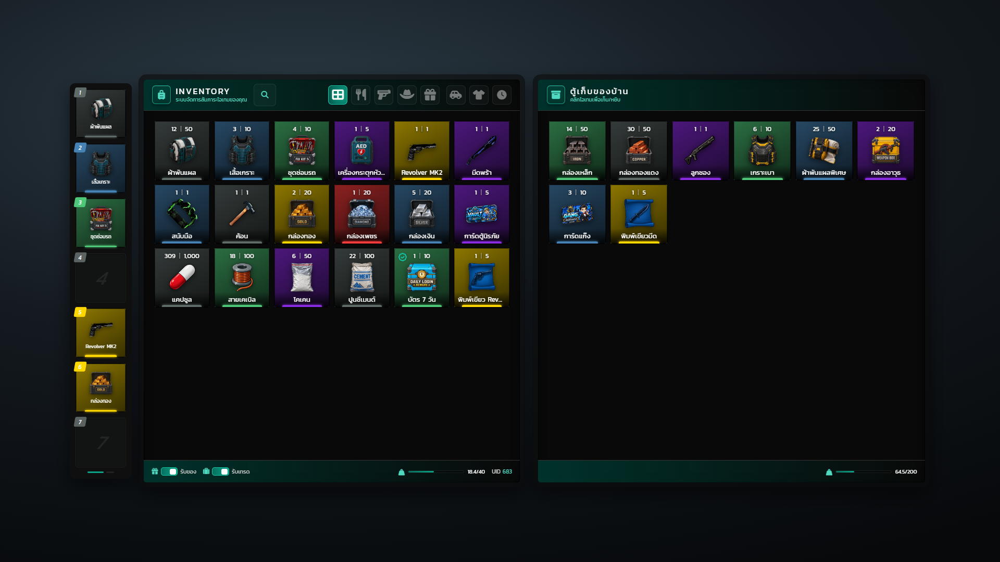

# ตู้เก็บของ (Stash)

เปิดแผงตู้ข้างกระเป๋าให้ผู้เล่น ใช้ทำท้ายรถ ตู้เซฟ ตู้บ้าน ตู้แก๊ง และเปิดกระเป๋าผู้เล่นคนอื่น — ฝั่ง **server** ทั้งหมด

ใช้อยู่ใน Hyper_Garage (ท้ายรถ), Hyper_Vault (ตู้เซฟ), Hyper_Admin (แอดมินเปิดกระเป๋าผู้เล่น), Hyper_Thief (ปล้น/ค้นตัว) — ทั้งหมดใช้ `OpenStashExternal` + `RefreshStash`

| Export | เมื่อไหร่ใช้ |
| --- | --- |
| `OpenStashExternal` | **แนะนำ** — resource ของคุณเก็บของและเซฟ DB เอง กระเป๋าแค่แสดงผล |
| `RefreshStash` | หลังเก็บ/หยิบสำเร็จ ส่งรายการของใหม่ให้ทุกคนที่เปิดตู้นี้ |
| `OpenStash` | ตู้ชั่วคราวในตัว เก็บใน RAM — restart แล้วของหาย |
| `GetStashItems` / `SetStashItems` | อ่าน/เขียนของในตู้ในตัว ถ้าอยากเซฟเอง |



## OpenStashExternal

```lua
exports["Hyper_Inventory"]:OpenStashExternal(playerId, opts)
```

| ฟิลด์ใน opts | ชนิด | ความหมาย |
| --- | --- | --- |
| `id` | string | รหัสตู้ (จำเป็น) เช่น `"trunk_" .. plate` |
| `label` | string | ชื่อบนหัวแผง |
| `slots` | number | จำนวนช่อง |
| `items` | table | `{ {name, label, count}, ... }` |
| `weight` / `maxWeight` | number | น้ำหนักปัจจุบัน / สูงสุด (หลอดความจุ) |
| `unitWeight` / `unitWeaponWeight` | number | น้ำหนักต่อชิ้น — ใช้ขึ้นไอคอนห้ามใส่เมื่อใส่ไม่ลง |
| `denyList` | table | ชื่อไอเทมที่ห้ามใส่ |
| `blockKinds` | table | ชนิดที่ห้ามใส่: `'item'` / `'weapon'` / `'account'` |
| `events` | table | `{ store = "...", take = "...", close = "..." }` ชื่อ event ฝั่ง server ของคุณ |

เมื่อผู้เล่นเก็บ/หยิบ กระเป๋าจะยิง event ให้ resource ของคุณ — ตรวจสิทธิ์ ย้ายของ เซฟ DB แล้วเรียก `RefreshStash`

| Event | Argument |
| --- | --- |
| `store` | `src, name, count, itype` |
| `take` | `src, name, count, itype` |
| `close` | `src, id` |

ตัวอย่างจาก Hyper_Garage (ท้ายรถ):

```lua
exports["Hyper_Inventory"]:OpenStashExternal(src, {
    id = "trunk_" .. plate,
    label = "ท้ายรถ " .. plate,
    slots = capS,
    weight = curW,
    maxWeight = maxW,
    unitWeight = 0.5,
    unitWeaponWeight = 5.0,
    denyList = Config.Trunk.ItemBlacklist or {},
    items = hyperItemList(plate),
    events = {
        store = "Hyper_Garage:trunkHyperStore",
        take = "Hyper_Garage:trunkHyperTake",
        close = "Hyper_Garage:trunkHyperClose",
    },
})

AddEventHandler("Hyper_Garage:trunkHyperStore", function(src, name, count, itype)
    -- ตรวจสิทธิ์ + ย้ายของ + เซฟ DB แล้ว:
    exports["Hyper_Inventory"]:RefreshStash(src, "trunk_" .. plate, hyperItemList(plate), curW)
end)
```

## RefreshStash

```lua
exports["Hyper_Inventory"]:RefreshStash(playerId, id, items, weight)
```

อัปเดตของในตู้ `id` และส่งให้ **ทุกคน** ที่เปิดตู้ใบนี้อยู่ `weight` ไม่ใส่ก็ได้

## OpenStash

```lua
exports["Hyper_Inventory"]:OpenStash(playerId, id, label, slots, maxWeight)
```

ตู้ในตัวของกระเป๋า เก็บใน RAM เท่านั้น — restart แล้วของหาย ใช้กับตู้ชั่วคราว หรือคู่กับ `GetStashItems` / `SetStashItems` ถ้าจะเซฟเอง

## GetStashItems / SetStashItems

```lua
local items = exports["Hyper_Inventory"]:GetStashItems(id)          -- { {name, label, count}, ... } หรือ nil
exports["Hyper_Inventory"]:SetStashItems(id, items, label, slots)
```

ใช้ได้เฉพาะตู้ในตัว (`OpenStash`) — ตู้ภายนอกคืน `nil` / ไม่ทำอะไร
