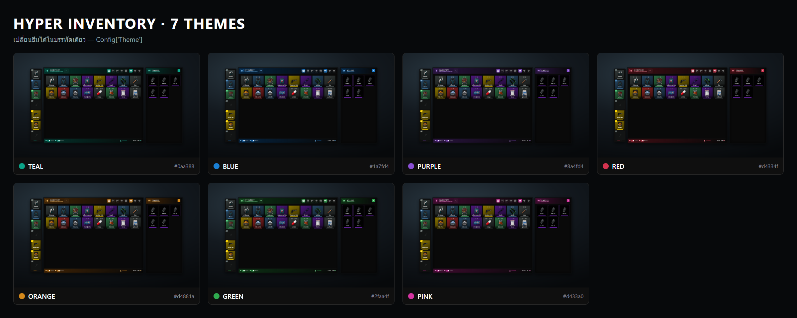
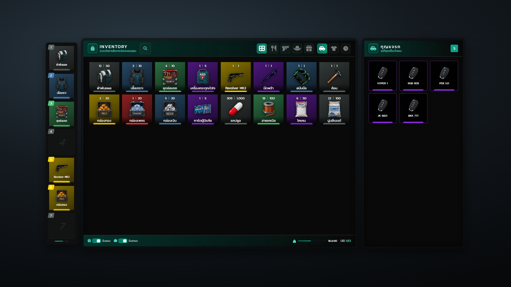
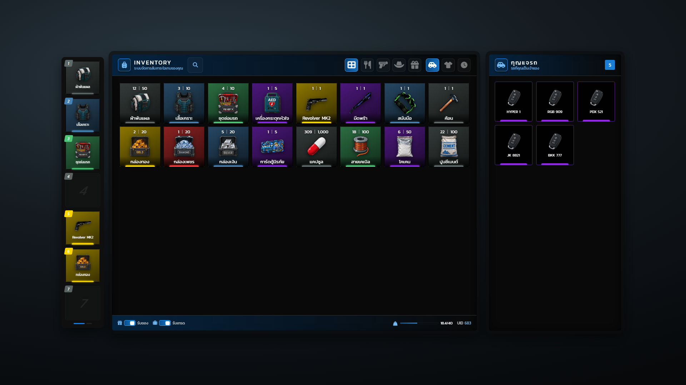
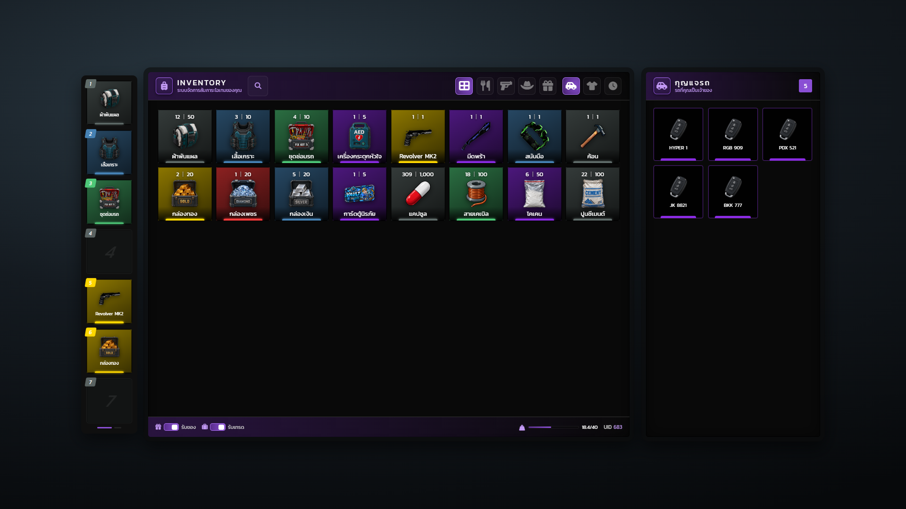
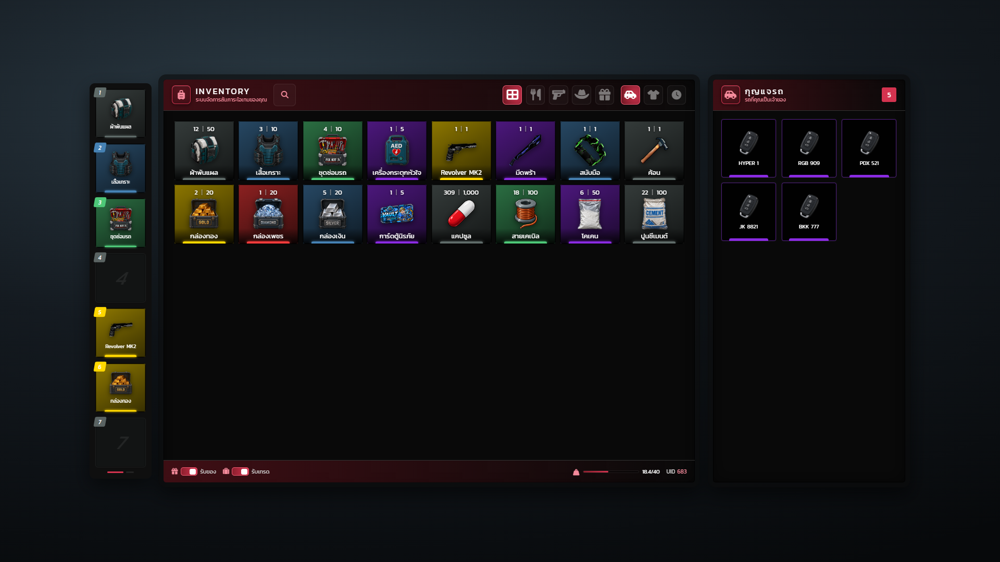
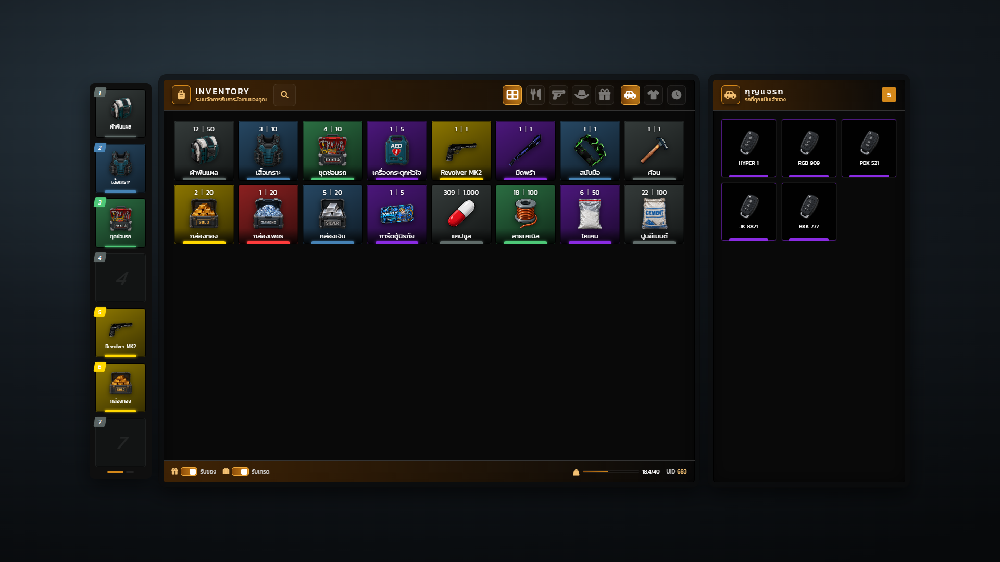
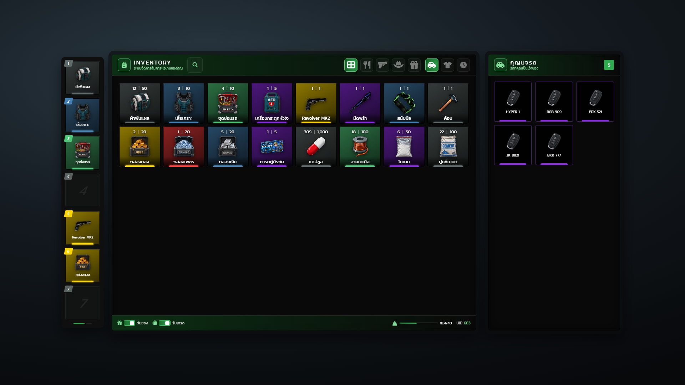
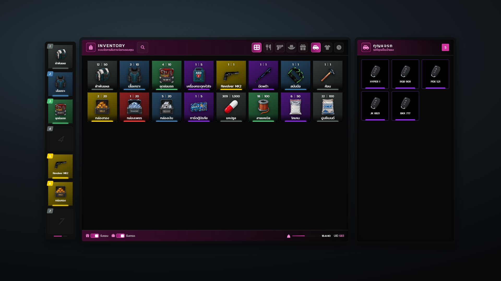

# ธีมสี

กระเป๋ามี 7 ธีมสี เปลี่ยนได้ด้วยค่าเดียว `Config['Theme']` ใน config/config.general.lua สี accent เปลี่ยนทั้งหน้าจอ (หัวแผง, แท็บ, ปุ่ม, สวิตช์, แถบน้ำหนัก) ส่วนสีการ์ด rarity คงเดิม



| ธีม | สีหลัก | สีสว่าง | สีเข้ม |
| --- | --- | --- | --- |
| teal (ค่าเริ่มต้น) | #0aa388 | #16c7a6 | #07705f |
| blue | #1a7fd4 | #3a9eef | #0a4d8c |
| purple | #8a4fd4 | #a96fef | #5a2d8c |
| red | #d4334f | #ef5a72 | #8c1f2d |
| orange | #d4881a | #efa83a | #8c4d0a |
| green | #2faa4f | #4fcf6f | #1a6b2d |
| pink | #d433a0 | #ef5abf | #8c1a6b |

```lua
Config["Theme"] = "teal" -- teal / blue / purple / red / orange / green / pink
```

## Teal



## Blue



## Purple



## Red



## Orange



## Green



## Pink


