# หน้าจอ UI แต่ละโหมด

ทุกภาพถ่ายจากโค้ด NUI จริง (html/index.html + style.css + app.js) ที่ 1920×1080 ใส่ข้อมูลจำลองและรูปไอเทมจริงของเซิร์ฟ

## 1. กระเป๋าหลัก

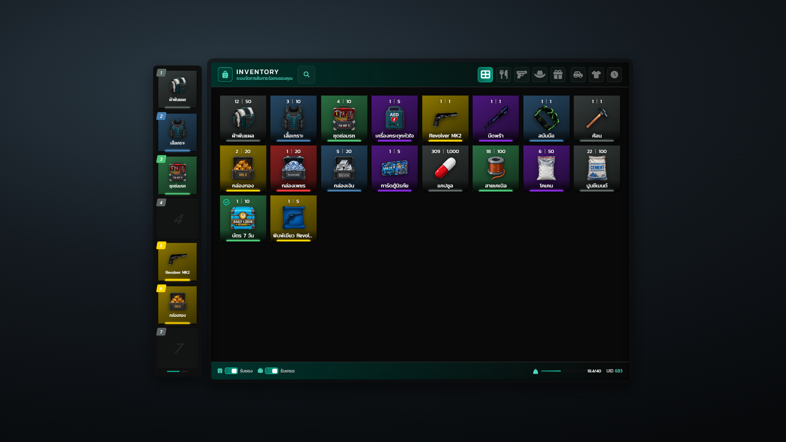

ซ้ายคือ fast-slot 7 ช่อง กลางคือกริดไอเทมสีตาม rarity แถบบนมีค้นหา แท็บกรอง และปุ่มแผงข้าง (กุญแจรถ, ใส่อยู่, หมดอายุ) แถบล่างมีสวิตช์รับของ/รับเทรด น้ำหนัก และ UID

## 2. รายละเอียดไอเทม (hover)

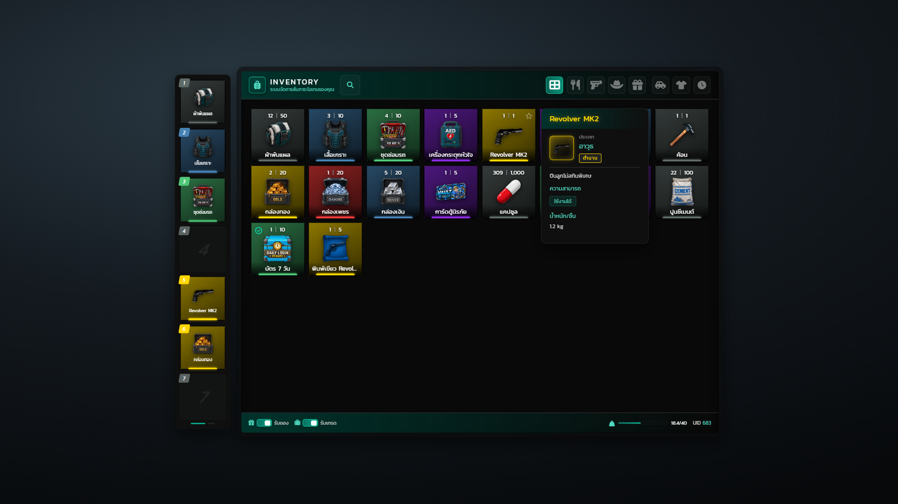

ชี้เมาส์ที่ไอเทมจะเปิดการ์ดรายละเอียด: ประเภท, ป้าย rarity, คำอธิบาย, สิทธิ์ใช้/มอบ/ทิ้ง และน้ำหนัก

## 3. เมนูคลิกขวา

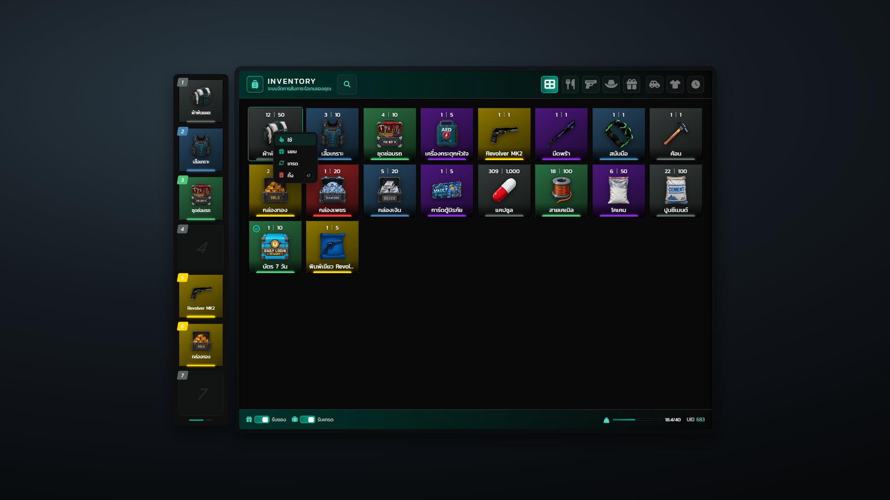

คลิกขวาไอเทมได้เมนู ใช้ / มอบ / เทรด / ทิ้ง (อาวุธที่มีสกินจะมีปุ่ม สกิน เพิ่ม)

## 4. แท็บกรอง (อาวุธ)

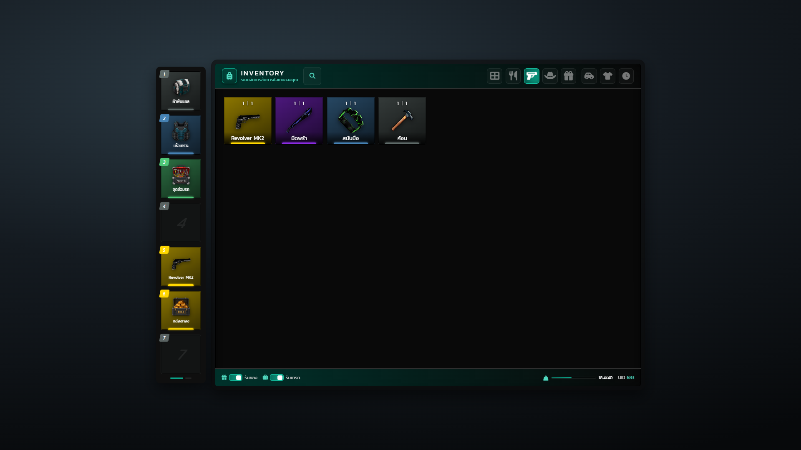

กดไอคอนหมวดด้านบนเพื่อกรองเฉพาะหมวดนั้น

## 5. แผงกุญแจรถ

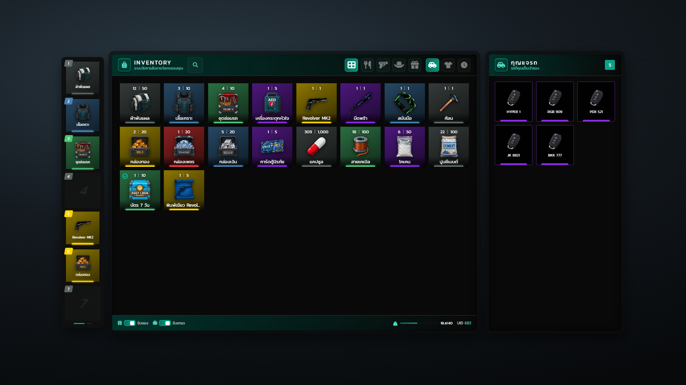

การ์ดที่สองเลื่อนออกมาข้างกระเป๋า แสดงทะเบียนรถที่เป็นเจ้าของ แผง ใส่อยู่ และ หมดอายุ ใช้การ์ดแบบเดียวกัน

## 6. ตู้เก็บของ (Stash)

กระเป๋าซ้าย ตู้ขวา คลิกหรือลากเพื่อเก็บ/หยิบ แถบล่างตู้บอกความจุที่ใช้ไป

## 7. เทรด

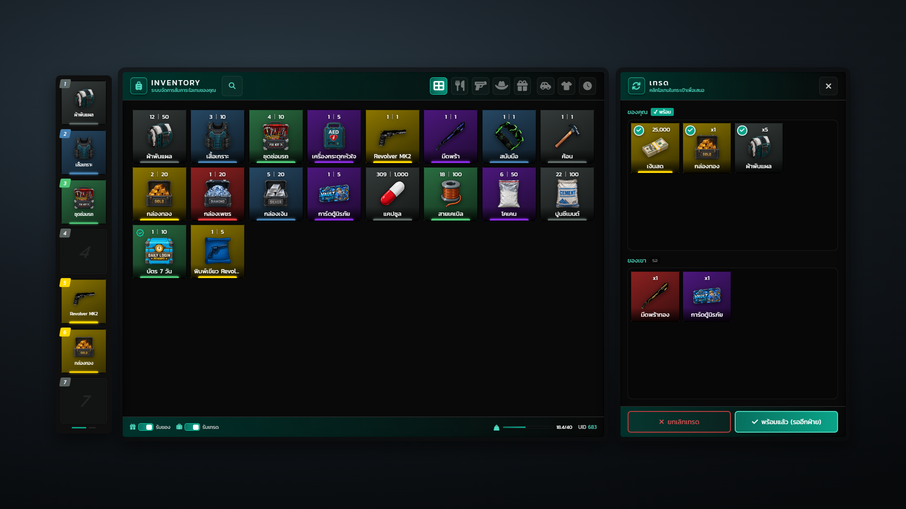

แผงขวาแบ่ง ของคุณ / ของเขา พร้อมป้ายสถานะ พร้อม/รอ เสนอเงินสดเป็นการ์ดได้ ดีลปิดเมื่อยืนยันทั้งสองฝั่ง

## 8. คำขอเทรด

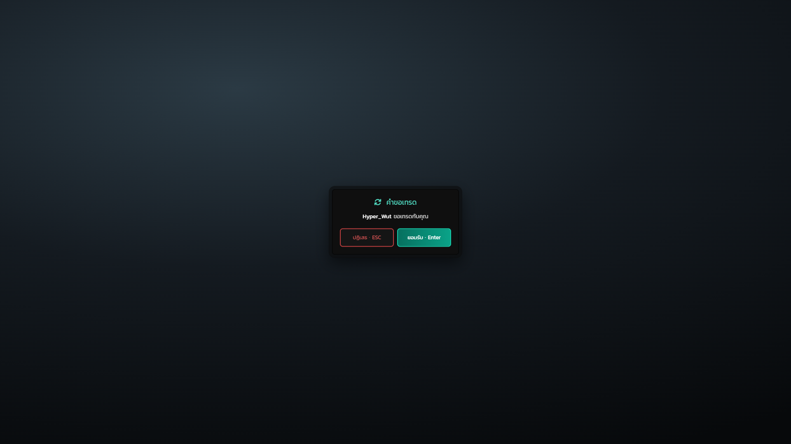

ป๊อปอัพเล็กที่ขึ้นแม้กระเป๋าปิดอยู่ กด Enter ยอมรับ หรือ ESC ปฏิเสธ

## 9. มอบของ — เลือกผู้รับ

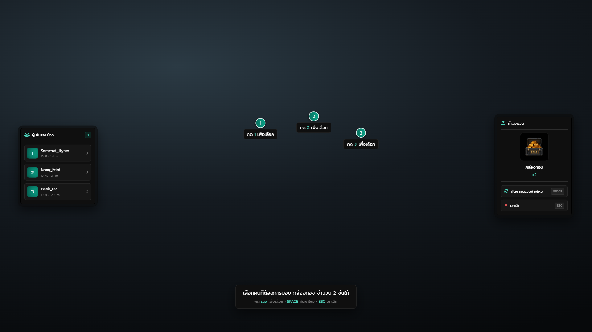

กระเป๋าหลบชั่วคราว ซ้ายคือรายชื่อคนรอบตัว ขวาคือของที่กำลังมอบ ป้ายเลขลอยเหนือหัวผู้เล่นจริงในเกม กดเลขเพื่อมอบ

## 10. Hotbar (กระเป๋าปิด)

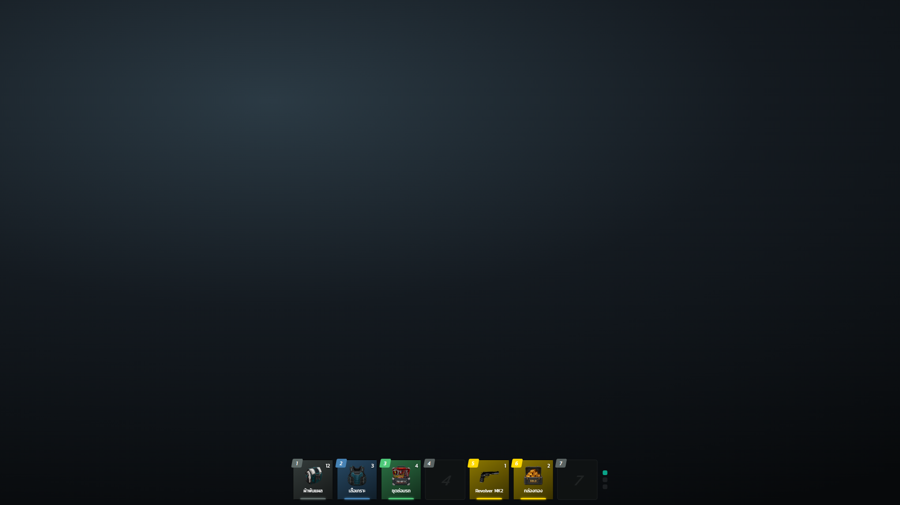

แถบ 7 ช่องค้างล่างจอ จุดด้านขวาบอกหน้าปัจจุบัน (3 หน้า)

## 11. Hotbar ในรถ

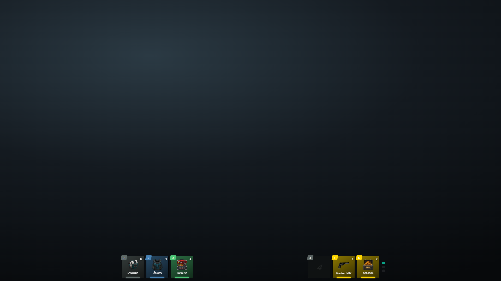

ลดเหลือ 6 ช่อง แบ่งซ้าย-ขวา เว้นกลางให้หน้าปัดความเร็ว

## 12. เลือกจำนวน (ทิ้ง/มอบ)

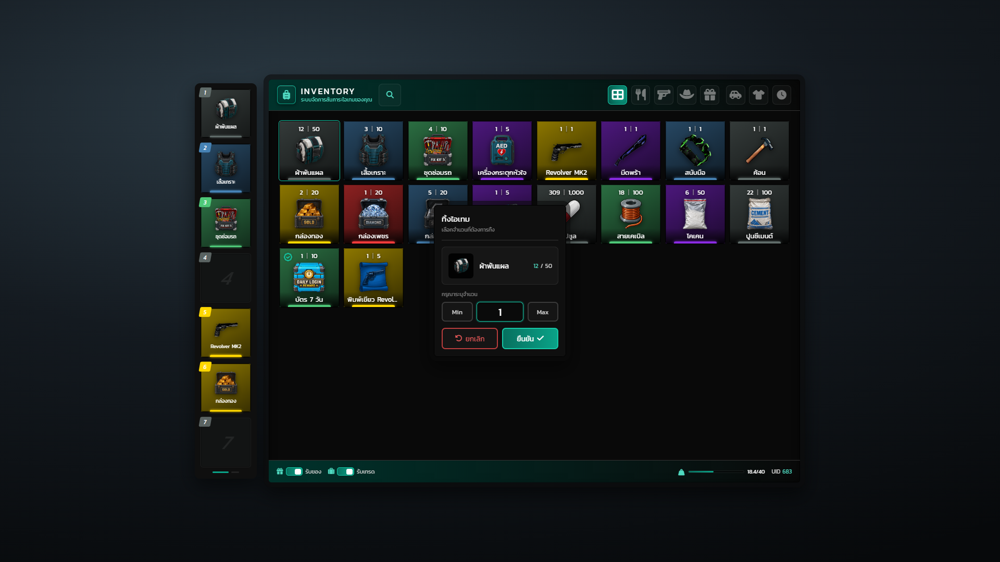

ป๊อปอัพกลางจอ มีปุ่ม Min/Max และจำนวนที่มีเทียบกับลิมิต
